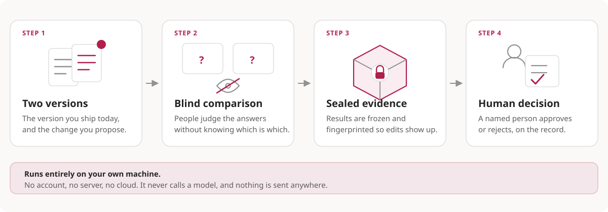

# Release Evidence Kit

**English** · [Türkçe](README.tr.md)

[Website](https://kivancakdeniz.github.io/release-evidence-kit/) · [Technical documentation](docs/README.md) · [Publication checklist](PUBLICATION-CHECKLIST.md)

[](https://github.com/kivancakdeniz/release-evidence-kit/actions/workflows/pages.yml)

> Public pre-draft design review. No implementation or conformance claim exists.


Release Evidence Kit proposes an open specification and plans a thin reference
implementation for producing portable, verifiable blind human evaluation
evidence for AI capability releases. It is not a product, a hosted service, or a
platform.

A capability can be a prompt, skill folder, agent configuration, toolset, RAG
strategy, workflow, or another file/folder artifact. The proposed recipe
snapshots candidate artifacts, imports outputs produced on the same cases and
declared runtime, collects blind preferences with rationale, freezes the
evidence, and records a human decision that anyone can verify offline.



## Project thesis

Existing tools already solve important parts of the workflow:

- eval runners execute prompt/model matrices,
- observability platforms store traces and experiments,
- annotation tools collect labels and preferences,
- some platforms version and promote prompts or workflows.

Release Evidence Kit defines only the missing binding between them:

```text
Git artifact snapshot
  -> imported outputs from the same task and declared runtime
  -> blind randomized comparison
  -> preference, rationale, tags
  -> frozen hash-verifiable evidence
  -> human decision
  -> portable attestation
```

The lesson from software supply chain provenance is that formats survive and
clients are replaceable. in-toto predicates, SLSA, SPDX, and CycloneDX became the
interoperable layer while signing and verification clients stayed interchangeable.
This project follows that shape: the evidence format is the intended deliverable,
the planned CLI is only a reference implementation, and adoption will be measured
in bundles produced and verified rather than in stars.

It is not intended to become another model gateway, tracing backend, workflow
engine, generic annotation platform, or prompt deployment manager.

Promptfoo already provides rich portable eval export/import. LangSmith and
Langfuse provide reviewer queues and release-oriented prompt workflows. Label
Studio provides flexible pairwise annotation and JSON export. Release Evidence
Kit does not claim those features as novel. Its proposed contribution is the
independently verifiable binding between artifact bytes, runtime, pre-registered
protocol, replayable assignment, human reviews, frozen exclusions, and a named
decision.

## What makes the evidence hard to fake

A study can look spotless and mean nothing. Six checks exist because each closes
one concrete way that happens:

- **Blinding is measured, not claimed.** Reviewers are asked which arm they
  believed was the candidate. Correct, incorrect, and declined guesses are
  reported as a descriptive diagnostic; v0.1 emits no automatic held/failed
  verdict.
- **The assignment plan is replayable.** The seed is revealed in the frozen
  bundle, and comparisons planned but never filled are counted, so an unfinished
  study cannot present as a small clean one.
- **The protocol is pre-registered.** Cases, rubric and both arms are hashed
  before the first review, so a re-run with different inputs is visible rather
  than silent.
- **Reviewer agreement is reported.** An aggregate split says nothing about
  whether reviewers agreed; observed agreement is reported alongside it.
- **Per-case regressions come first.** The list of cases that used to win and no
  longer do is the number that actually blocks releases.
- **Core verification must need no tooling from this project.** Manifest, directory
  identity and review log checks are plain `sha256` pipelines, with a POSIX shell
  verifier planned alongside the reference CLI.

None of this prevents bad faith. It only makes bad faith impossible to commit
quietly, which is the strongest claim this project makes anywhere.

## Target operating model


The reference implementation must preserve these constraints when it is built:

- no account, no sign-up, and no hosted service,
- no database, and no server process beyond a local review page,
- no provider credentials, because the project never calls a model,
- no telemetry, and no network access required to verify a bundle,
- must run on a laptop, in CI, or on an air-gapped machine.

The planned public artifacts are a specification, conformance vectors, a
reference CLI, a GitHub Action, and deployment recipes. Anyone must be able to
implement the format independently, and any team should be able to stand the
workflow up without asking permission from this project or paying anyone.

## Agreed direction

- Shape: specification first, thin reference CLI second, GitHub Action third,
  conformance vectors alongside.
- Reuse: in-toto Statement v1 and DSSE. Define one new predicate. Reuse the
  in-toto Simple Verification Result predicate for the human decision record.
- Capability artifact: immutable file or folder snapshot; type is metadata.
- Study mode: pairwise baseline/candidate comparison. N-arm ranking is deferred
  and may need a separate predicate version.
- Decision: policy checks may recommend; a named human records the decision.
- Reference stack: one Node.js 24 package using strict TypeScript and ESM, Node
  built-ins for the CLI and loopback listener, a browser-native review page,
  append-only JSONL, and self-contained bundles. The independent verifier has a
  disjoint import graph; core checks also have a dependency-free POSIX verifier.
  Node.js 22.14+ remains a compatibility target only while it stays low-cost.
- Execution: imported outputs only. The project never runs models.
- Licensing: this public design repository is Apache-2.0. The later dedicated
  specification repository adopts the full Community Specification process, not
  only its license text. Vectors use a permissive license; implementation code is
  Apache-2.0.
- Repositories: specification and vectors separate from the implementation.
- Explicitly not planned: hosted service, SQLite or PostgreSQL control plane,
  management UI, OIDC, multi-tenant deployment, public collector, provider
  runners, and shell execution.
- Publication: this workspace may be public as a non-normative P0 design review.
  Approved specification and package releases remain blocked by their separate
  roadmap gates.

## Planning documents

- [Technical documentation index](docs/README.md) · [Türkçe](docs/tr/README.md)
- [Scope and non-goals](docs/SCOPE.md) · [Türkçe](docs/tr/SCOPE.md)
- [Evidence format draft](docs/SPEC-DRAFT.md) · [Türkçe](docs/tr/SPEC-DRAFT.md)
- [Landscape research](docs/LANDSCAPE.md) · [Türkçe](docs/tr/LANDSCAPE.md)
- [Architecture](docs/ARCHITECTURE.md) · [Türkçe](docs/tr/ARCHITECTURE.md)
- [Domain model](docs/DOMAIN-MODEL.md) · [Türkçe](docs/tr/DOMAIN-MODEL.md)
- [Security and threat model](docs/THREAT-MODEL.md) · [Türkçe](docs/tr/THREAT-MODEL.md)
- [Delivery roadmap](docs/ROADMAP.md) · [Türkçe](docs/tr/ROADMAP.md)
- [Architecture decisions](docs/DECISIONS.md) · [Türkçe](docs/tr/DECISIONS.md)

## Public project files

- [Machine-readable project status](PROJECT-STATUS.md) · [Türkçe](PROJECT-STATUS.tr.md)
- [Publication checklist](PUBLICATION-CHECKLIST.md) · [Türkçe](PUBLICATION-CHECKLIST.tr.md)
- [Governance and succession](GOVERNANCE.md) · [Türkçe](GOVERNANCE.tr.md)
- [Contribution process](CONTRIBUTING.md) · [Türkçe](CONTRIBUTING.tr.md)
- [Security reporting](SECURITY.md) · [Türkçe](SECURITY.tr.md)
- [Code of conduct](CODE_OF_CONDUCT.md) · [Türkçe](CODE_OF_CONDUCT.tr.md)
- [Changelog](CHANGELOG.md) · [Türkçe](CHANGELOG.tr.md)
- [Asset provenance status](assets/README.md)

## First release boundary

The first release will accept two capability folders, a case dataset, and
imported outputs; compute deterministic directory digests; serve an identity-blind
pairwise review; write append-only reviews; freeze a descriptive evidence bundle;
record a human decision; and verify the whole chain offline.

It excludes databases, a management API or UI, authentication, hosted anything,
N-arm ranking, trace storage, provider runners, statistical eligibility claims,
and shell execution. These are not deferred features waiting for demand; they are
outside the project.

## Success signals

Success is measured by whether the format is used and verified, not by adoption
volume:

1. a clean machine produces a verified bundle in under 15 minutes,
2. at least one team outside the maintainer produces bundles repeatedly,
3. at least one real release decision is changed, blocked, or documented
   materially better because of blind evidence,
4. an independent verifier, sharing no code with the producer, passes the
   published conformance vectors,
5. at least one third-party implementation or integration exists.

Signals 4 and 5 matter most. Every small specification that survived had either a
working conformance suite or more than one independent implementation. Every one
that died had a single vendor and neither.

If signals 1 to 3 fail, freeze the specification, mark the repository status
honestly, and keep the vectors readable. Abandonment is the expected failure mode
in this category, so it must be made harmless rather than denied.
