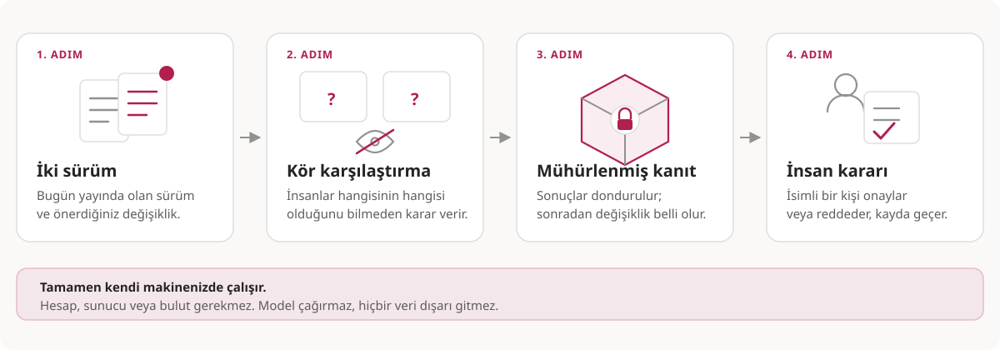

# Release Evidence Kit

[English](README.md) · **Türkçe**

[Web sitesi](https://kivancakdeniz.github.io/release-evidence-kit/) · [Türkçe teknik dokümantasyon](docs/tr/README.md) · [Yayın checklist'i](PUBLICATION-CHECKLIST.tr.md)

[](https://github.com/kivancakdeniz/release-evidence-kit/actions/workflows/pages.yml)

> Public ön taslak incelemesi. Henüz implementasyon veya uyumluluk iddiası yok.


Release Evidence Kit, AI capability release'leri için taşınabilir ve
doğrulanabilir kör insan değerlendirmesi kanıtı üretmeye yarayan açık bir
spesifikasyon önerir ve ince bir referans uygulama planlar. Bir ürün, barındırılan
bir hizmet veya bir platform değildir.

Capability; bir prompt, skill klasörü, agent konfigürasyonu, toolset, RAG
stratejisi, workflow veya başka bir dosya/klasör artefaktı olabilir. Önerilen
reçete aday artefaktların anlık görüntüsünü alır, aynı case seti ve beyan edilmiş
runtime üzerinde üretilmiş çıktıları içeri alır, gerekçeleriyle birlikte kör
tercihleri toplar, kanıtı dondurur ve herkesin çevrimdışı doğrulayabileceği bir
insan kararı kaydeder.



## Projenin tezi

Mevcut araçlar akışın önemli parçalarını zaten çözüyor:

- eval runner'lar prompt/model matrislerini çalıştırıyor,
- observability platformları trace ve deneyleri saklıyor,
- annotation araçları etiket ve tercih topluyor,
- bazı platformlar prompt veya workflow'ları sürümleyip terfi ettiriyor.

Release Evidence Kit yalnızca aralarındaki eksik bağı tanımlar:

```text
Git artefakt anlık görüntüsü
  -> aynı görev ve beyan edilmiş runtime'dan içeri alınmış çıktılar
  -> kör, rastgeleleştirilmiş karşılaştırma
  -> tercih, gerekçe, etiket
  -> dondurulmuş, hash ile doğrulanabilir kanıt
  -> insan kararı
  -> taşınabilir attestation
```

Yazılım tedarik zinciri provenance alanından çıkan ders şu: formatlar hayatta
kalır, istemciler değiştirilebilir. in-toto predicate'leri, SLSA, SPDX ve
CycloneDX birlikte çalışabilir katman hâline gelirken imzalama ve doğrulama
istemcileri birbirinin yerine geçebilir kaldı. Bu proje de aynı biçimi izliyor:
hedeflenen teslimat kanıt formatı, planlanan CLI yalnızca bir referans uygulama ve
benimsenme yıldızla değil üretilip doğrulanan paket sayısıyla ölçülecek.

Amacı bir model gateway'i, tracing backend'i, workflow motoru, genel amaçlı
annotation platformu veya prompt deployment yöneticisi olmak değildir.

Promptfoo zaten zengin ve taşınabilir eval export/import sağlıyor. LangSmith ve
Langfuse reviewer queue ve release odaklı prompt workflow'ları sunuyor. Label
Studio esnek ikili annotation ve JSON export sağlıyor. Release Evidence Kit
bunları yeni özellikler olarak iddia etmiyor. Önerdiği katkı; artefakt baytları,
runtime, ön kayıtlı protokol, yeniden oynatılabilir atama, insan review'ları,
dondurulmuş exclusion'lar ve isimli karar arasındaki bağı bağımsız doğrulanabilir
hâle getirmek.

## Kanıtı taklit etmeyi zorlaştıran şey

Bir çalışma tertemiz görünüp hiçbir şey ifade etmeyebilir. Altı kontrolün her
biri, bunun olduğu somut bir yolu kapatır:

- **Körlük ölçülür, iddia edilmez.** Değerlendiriciye hangi kolun aday olduğunu
  düşündüğü sorulur. Doğru, yanlış ve çekimser tahminler betimsel diagnostic
  olarak raporlanır; v0.1 otomatik tuttu/kalmadı verdict'i üretmez.
- **Atama planı yeniden oynatılabilir.** Tohum dondurulmuş pakette açığa çıkar ve
  planlanıp doldurulmamış karşılaştırmalar sayılır; böylece yarım kalmış bir
  çalışma küçük ve temiz bir çalışma gibi görünemez.
- **Protokol önceden kaydedilir.** Case'ler, rubrik ve iki kol ilk
  değerlendirmeden önce özetlenir; farklı girdilerle tekrar çalıştırmak sessiz
  kalmaz, görünür olur.
- **Değerlendirici uyumu raporlanır.** Toplam skor, değerlendiricilerin uyuşup
  uyuşmadığı hakkında hiçbir şey söylemez; gözlenen uyum yanına yazılır.
- **Önce case bazlı gerilemeler.** Eskiden kazanırken artık kazanmayan case'lerin
  listesi, release'i gerçekten durduran sayıdır.
- **Temel doğrulama bu projenin aracına ihtiyaç duymamalı.** Manifest, dizin kimliği
  ve inceleme kaydı kontrolleri düz `sha256` komutlarıdır; referans CLI'ın yanında
  bir POSIX shell doğrulayıcı yayımlanması planlanır.

Bunların hiçbiri kötü niyeti engellemez. Yalnızca kötü niyeti sessizce
uygulamayı imkânsızlaştırır; projenin herhangi bir yerde öne sürdüğü en güçlü
iddia da budur.

## Hedef işletim modeli


Referans implementasyon geliştirildiğinde şu sınırları korumak zorunda:

- hesap, kayıt ve barındırılan hizmet yok,
- veritabanı yok; yerel inceleme sayfası dışında sunucu süreci yok,
- sağlayıcı kimlik bilgisi yok, çünkü proje hiçbir zaman model çağırmaz,
- telemetri yok; bir paketi doğrulamak için ağ erişimi gerekmez,
- dizüstünde, CI'da veya ağdan tamamen kopuk bir makinede çalışmak zorunda.

Planlanan public artefaktlar bir spesifikasyon, uyumluluk vektörleri, bir referans
CLI, bir GitHub Action ve deployment reçeteleridir. Formatı isteyen bağımsız
olarak uygulayabilmeli; herhangi bir ekip bu projeden izin almadan ve kimseye
ödeme yapmadan akışı ayağa kaldırabilmeli.

## Üzerinde uzlaşılan yön

- Biçim: önce spesifikasyon, sonra ince bir referans CLI, sonra GitHub Action;
  uyumluluk vektörleri bunlarla birlikte.
- Yeniden kullanım: in-toto Statement v1 ve DSSE. Yalnızca tek bir yeni predicate
  tanımlanır. İnsan kararı kaydı için in-toto Simple Verification Result
  predicate'i yeniden kullanılır.
- Capability artefaktı: değişmez dosya/klasör anlık görüntüsü; tür bir metadata
  alanıdır.
- Çalışma modu: baseline/candidate ikili karşılaştırması. N-arm sıralama ertelendi
  ve ayrı bir predicate sürümü gerektirebilir.
- Karar: politika kontrolleri öneri verebilir; kararı isimli bir insan kaydeder.
- Referans yığın: strict TypeScript ve ESM kullanan tek Node.js 24 paketi; CLI ve
  loopback listener için Node built-in'leri; browser-native review sayfası;
  append-only JSONL ve kendi kendine yeten paketler. Bağımsız verifier'ın import
  grafiği ayrı; core kontroller için ayrıca bağımlılıksız POSIX verifier var.
  Node.js 22.14+ yalnız düşük maliyetli kaldığı sürece uyumluluk hedefi.
- Yürütme: yalnızca içeri alınmış çıktılar. Proje hiçbir zaman model çalıştırmaz.
- Lisanslama: bu public tasarım deposu Apache-2.0. Daha sonra açılacak ayrı
  spesifikasyon deposu yalnız lisans metnini değil, Community Specification
  sürecinin tamamını benimseyecek. Vektörler izin verici lisans, implementasyon
  kodu Apache-2.0 kullanacak.
- Depolar: spesifikasyon ve vektörler, implementasyondan ayrı.
- Açıkça planlanmayanlar: barındırılan hizmet, SQLite veya PostgreSQL control
  plane, yönetim arayüzü, OIDC, çok kiracılı deployment, halka açık toplayıcı,
  sağlayıcı runner'ları ve shell yürütme.
- Yayın: bu workspace, normatif olmayan P0 tasarım incelemesi olarak public
  olabilir. Approved specification ve paket yayınları kendi roadmap kapılarına
  kadar bloke kalır.

## Planlama dokümanları

İngilizce metin teknik yorum için yetkilidir; Türkçe belgeler eksiksiz,
bilgilendirme amaçlı çevirilerdir.

- [Türkçe teknik dokümantasyon indeksi](docs/tr/README.md) · [English](docs/README.md)
- [Kapsam ve kapsam dışı](docs/tr/SCOPE.md) · [English](docs/SCOPE.md)
- [Kanıt formatı taslağı](docs/tr/SPEC-DRAFT.md) · [English](docs/SPEC-DRAFT.md)
- [Pazar ve rakip araştırması](docs/tr/LANDSCAPE.md) · [English](docs/LANDSCAPE.md)
- [Mimari](docs/tr/ARCHITECTURE.md) · [English](docs/ARCHITECTURE.md)
- [Alan modeli](docs/tr/DOMAIN-MODEL.md) · [English](docs/DOMAIN-MODEL.md)
- [Güvenlik ve tehdit modeli](docs/tr/THREAT-MODEL.md) · [English](docs/THREAT-MODEL.md)
- [Teslim yol haritası](docs/tr/ROADMAP.md) · [English](docs/ROADMAP.md)
- [Mimari kararlar](docs/tr/DECISIONS.md) · [English](docs/DECISIONS.md)

## Public proje dosyaları

- [Makinece okunabilir proje durumu](PROJECT-STATUS.tr.md) · [English](PROJECT-STATUS.md)
- [Yayın checklist'i](PUBLICATION-CHECKLIST.tr.md) · [English](PUBLICATION-CHECKLIST.md)
- [Yönetişim ve halef planı](GOVERNANCE.tr.md) · [English](GOVERNANCE.md)
- [Katkı süreci](CONTRIBUTING.tr.md) · [English](CONTRIBUTING.md)
- [Güvenlik bildirimi](SECURITY.tr.md) · [English](SECURITY.md)
- [Davranış kuralları](CODE_OF_CONDUCT.tr.md) · [English](CODE_OF_CONDUCT.md)
- [Değişiklik günlüğü](CHANGELOG.tr.md) · [English](CHANGELOG.md)
- [Görsel provenance durumu](assets/README.md)

## İlk sürümün sınırı

İlk sürüm iki capability klasörü, bir case veri kümesi ve içeri alınmış çıktıları
kabul edecek; deterministik dizin özetlerini hesaplayacak; kimlik gizlenmiş ikili
inceleme sunacak; incelemeleri append-only yazacak; betimsel bir kanıt paketini
donduracak; bir insan kararı kaydedecek ve tüm zinciri çevrimdışı doğrulayacak.

Kapsam dışında kalanlar: veritabanları, yönetim API'si veya arayüzü, kimlik
doğrulama, herhangi bir barındırılan bileşen, N-arm sıralama, trace depolama,
sağlayıcı runner'ları, istatistiksel yeterlilik iddiaları ve shell yürütme.
Bunlar talep bekleyen ertelenmiş özellikler değildir; projenin dışındadır.

## Başarı sinyalleri

Başarı, benimsenme hacmiyle değil, formatın kullanılıp doğrulanmasıyla ölçülür:

1. temiz bir makine 15 dakikadan kısa sürede doğrulanmış bir paket üretir,
2. bakımcı dışında en az bir ekip düzenli olarak paket üretir,
3. kör kanıt sayesinde en az bir gerçek release kararı değişir, engellenir ya da
   belirgin biçimde daha iyi belgelenir,
4. üreticiyle hiç kod paylaşmayan bağımsız bir doğrulayıcı, yayımlanan uyumluluk
   vektörlerini geçer,
5. en az bir üçüncü taraf implementasyon veya entegrasyon bulunur.

En kritik olanlar 4 ve 5. numaralı sinyallerdir. Hayatta kalan her küçük
spesifikasyonun ya çalışan bir uyumluluk paketi ya da birden fazla bağımsız
implementasyonu vardı. Ölenlerin ise tek bir satıcısı vardı ve ikisi de yoktu.

1-3 arası sinyaller başarısız olursa: spesifikasyonu dondurun, depo durumunu
dürüstçe işaretleyin ve vektörleri okunabilir bırakın. Bu kategoride beklenen
başarısızlık biçimi terk edilmedir; bu yüzden inkâr edilmek yerine zararsız hâle
getirilmelidir.
